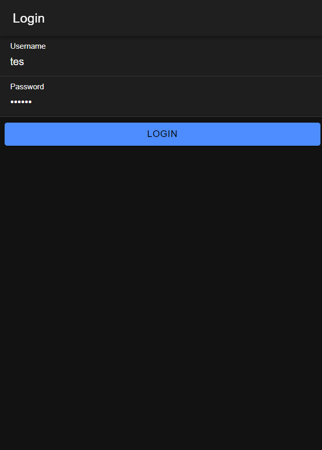
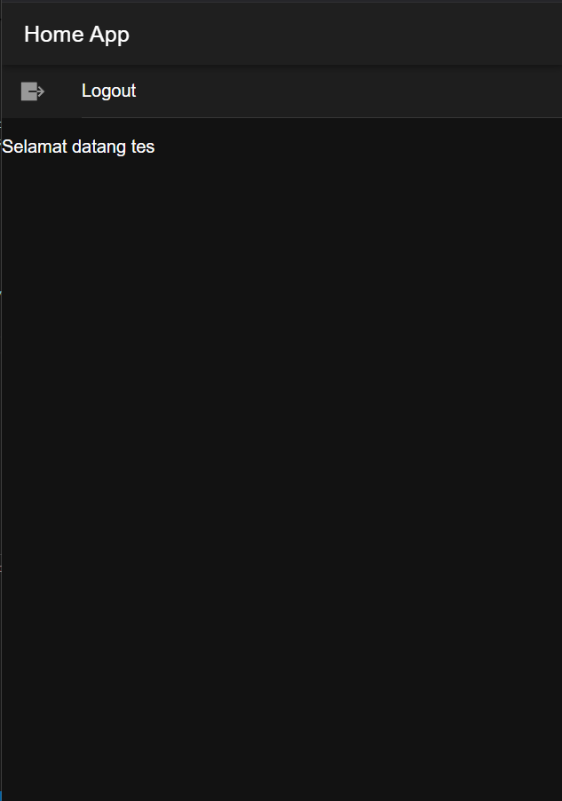

# Tugas 7 Praktikum Pemrograman Mobile
 
Nama: Reyno Alfarez Marchelian

NIM: H1D022111

Shift: B

Pertemuan: 8

# Penjelasan

1. Buat database yang berisi tabel user yang memiliki kolom username dan password
2. Buat file koneksi.php untuk mengatur koneksi ke database MySQL
3. Pada file login.php, data yang dimasukkan user akan dicocokkan dengan data di database.
4. Jika username dan password == data di database, API mengirimkan respons status_login sebagai "berhasil". Jika tidak cocok, status_login akan berisi "gagal".
5. Di halaman login Ionic, saat pengguna menekan tombol login, username dan password dikirim ke login.php.
6. Jika API merespons dengan status_login "berhasil", AuthenticationService menyimpan token dan username di penyimpanan preferences dan menetapkan isAuthenticated ke true untuk menunjukkan bahwa pengguna sudah login.
7. Setelah login berhasil, pengguna secara otomatis diarahkan ke halaman utama aplikasi.

# Screenshot

